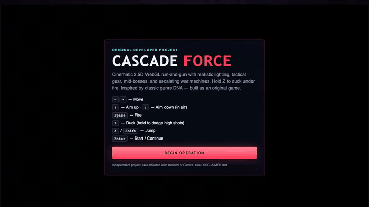
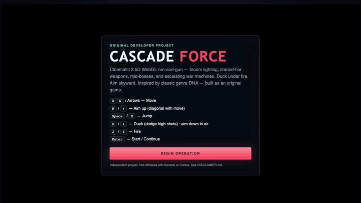
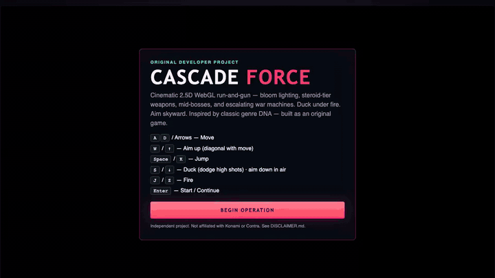

# Cascade Force

Cinematic **2.5D WebGL** run-and-gun with realistic daylight lighting, tactical gear, and steroid-tier weapon drops.

Inspired by classic genre DNA. **Not affiliated with Konami or Contra.** See [DISCLAIMER.md](./DISCLAIMER.md).

## Play

```bash
npm install
npm run dev
```

Open **http://localhost:5174**.

**Controls:** **← →** move · **Space** fire · **Z / ↓** duck · **W / X** jump · **↑** aim up · **Enter** start

---

## Live gameplay

Real captures from the running WebGL build — each clip is a **5-second loop** (GIF for the README; MP4 also in [`media/`](./media/)).

### Title

<p align="center">
  
</p>

### Pulse rifle combat

<p align="center">
  
</p>

### Hyper Spread

<p align="center">
  
</p>

### Duck under fire

<p align="center">
  
</p>

### Aim skyward

<p align="center">
  
</p>

### Mid-boss clash

<p align="center">
  
</p>

### Inferno Thrower

<p align="center">
  
</p>

MP4 versions (same 5s loops):  
[title](media/01-title.mp4) · [combat](media/02-live-combat.mp4) · [spread](media/03-hyper-spread.mp4) · [duck](media/04-duck-dodge.mp4) · [aim up](media/05-aim-skyward.mp4) · [mid-boss](media/06-midboss-clash.mp4) · [inferno](media/07-inferno-push.mp4)

Re-capture locally (dev server on :5174 + ffmpeg + Playwright):

```bash
npm run dev
npm run capture
```

---

## Controls

| Input | Action |
|-------|--------|
| ← → | Move |
| **Space** | **Fire** |
| **Z** / **↓** | **Duck** (hold — dodge high shots) |
| **W** / **X** / Shift | **Jump** |
| ↑ | Aim up |
| Enter | Start / Continue |

## Campaign

| Op | Theater | Mid-boss | Main boss |
|----|---------|----------|-----------|
| 1 | Jungle Teeth | Canopy Stalker | Rootbreaker MK-I |
| 2 | Baseline Siege | Rail Crusher | Fortress Core |
| 3 | Red Cascade | Void Sentinel | **Cascade Overlord** |

## Stack

Vite · TypeScript · Three.js · EffectComposer bloom

## License

MIT — see [LICENSE](./LICENSE).
